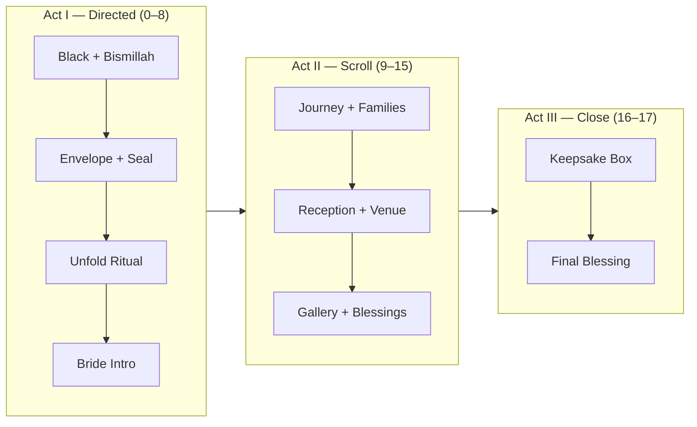

# Bride's wedding invitation design
_Exported on 7/3/2026 at 02:00:13 GMT+5:30 from Cursor (3.9.16)_

---

**User**

# MASTER PROMPT — Premium Bride Wedding Invitation Website

You are an award-winning Creative Director, Product Designer, Motion Designer, UI/UX Expert, and Senior Next.js Engineer.

## Project Overview

The groom already has a premium digitals dding invitation.

### Groom

**Jithin Abdulsalam**

### Bride

**Safna Latheef**

The existing website represents the groom's invitation.

Your task is **NOT** to redesign it or make a feminine copy.

Instead, create a completely new experience that represents **the bride's side of the story**, while visually complementing the groom's website.

When guests visit both websites, they should feel like they are reading two chapters of the same love story.

---

# Wedding Information

Bride:
**Safna Latheef**

Groom:
**Jithin Abdulsalam**

Wedding Reception

**Sunday**
**16 August 2026**

**3 Rabi' al-Awwal 1448 AH**

Time

11:00 AM – 3:00 PM (IST)

Venue

Everest Convention Centre

Karikkad, Thrissur, Kerala

Google Maps link will be provided separately.

---

# Bride's Family

Mr. Latheef K.

Mrs. Arifa Kammukutty

Kottekatil House

Nammarapadam

Nemmara

Palakkad District

---

# Groom's Family

Mr. Abdulsalam

Mrs. Salma

Thayyullyill House

Akkikavu

Thrissur

---

# Design Direction

Theme

**"From Her Heart"**

This is not merely an invitation.

It is an emotional digital experience.

Visitors should feel warmth, elegance, serenity, and blessings.

The visual language should be inspired by:

* Luxury wedding stationery
* Editorial magazines
* Islamic geometric elegance
* Kerala tradition
* Minimal luxury
* Apple storytelling
* Fine art books

Avoid:

* Bright pink themes
* Glitter
* Heavy animations
* Generic wedding templates
* Cheap gradients
* Excessive floral decorations

---

# Color Palette

Ivory

Champagne

Warm White

Soft Sage

Muted Gold

Light Sand

Very subtle green accents inspired by Kerala.

---

# Typography

Heading

Cormorant Garamond

Accent

Great Vibes

Body

Inter

Spacing should feel premium with generous whitespace.

---

# Experience Flow

Instead of ordinary sections, create a story.

Chapter 1

Welcome

↓

Chapter 2

A Letter from Safna

↓

Chapter 3

Her Journey

↓

Chapter 4

Their Story

↓

Chapter 5

Reception Details

↓

Chapter 6

Venue

↓

Chapter 7

Family

↓

Chapter 8

Gallery

↓

Chapter 9

Countdown

↓

Chapter 10

Blessings

↓

Chapter 11

Thank You

---

# Opening Animation

Begin with an ivory canvas.

Soft instrumental music (optional).

Subtle jasmine petals drifting gently.

Elegant handwritten text fades in:

> "Every beautiful beginning starts with a prayer."

The invitation then unfolds like handcrafted paper.

No loading spinner.

---

# Hero Section

Large elegant portrait of Safna.

Calligraphy of her name.

Subtitle:

"Daughter of"

Mr. Latheef K.

Mrs. Arifa Kammukutty

Invitation text.

Scroll indicator.

Very slow floating animation.

---

# Motion Design

Use

Framer Motion

Lenis

Animations should include:

Paper unfolding

Fade

Blur reveal

Letter-by-letter text

Soft image masking

Gentle parallax

Elegant transitions

No bounce.

No flashy effects.

---

# Story Timeline

Do not use dates.

Create an emotional journey.

🌿

A Prayer

↓

A Smile

↓

A Conversation

↓

Two Families

↓

A Promise

↓

Forever

---

# Event Details

Display reception details using premium cards.

Include

Date

Islamic date

Time

Venue

Dress code (optional)

Family welcome message

---

# Venue Section

Premium venue card.

Include

Venue photo

Address

Google Maps button

Navigation button

Parking information

Nearby landmarks

Google Maps URL will be added later.

---

# Countdown

Elegant circular countdown.

Minimal.

Luxury.

---

# Family Section

Introduce both families beautifully.

Bride's Family

Mr. Latheef K.

Mrs. Arifa Kammukutty

Kottekatil House

Nammarapadam

Nemmara

Palakkad District

—

Groom's Family

Mr. Abdulsalam

Mrs. Salma

Thayyullyill House

Akkikavu

Thrissur

This section should celebrate the union of two families rather than simply list names.

---

# Gallery

Avoid grids.

Create floating editorial-style photographs.

Images expand beautifully.

Background softly blurs.

---

# Blessings

Guests may leave wishes.

After submission:

A flower blooms.

Display:

"Jazakum Allahu Khairan for your blessings."

Messages appear as elegant cards.

---

# Cursor Interaction

Desktop only.

The cursor should leave tiny jasmine petals.

Extremely subtle.

---

# Sound

No autoplay.

Provide:

"Begin the Experience"

Soft piano

Ambient strings

Mute toggle

---

# Easter Eggs

Hidden blessings.

Long press the wedding seal.

Flowers bloom.

Hidden dua.

Night mode after sunset.

Subtle Islamic geometric animation.

Nothing childish.

---

# Long-Term Vision

This website should continue existing long after the wedding.

Before the wedding:

* Invitation
* Countdown
* RSVP
* Venue
* Schedule

Wedding day:

* Live moments
* Photo uploads
* Announcements

After wedding:

* Wedding gallery
* Wedding film
* Guestbook
* Thank-you message
* Anniversary timeline
* Digital memory archive

The invitation should evolve into a timeless family keepsake rather than becoming obsolete after the event.

---

# Tech Stack

Next.js App Router

TypeScript

Tailwind CSS

shadcn/ui

Framer Motion

Lenis

Cloudinary

Supabase

Vercel

Fully responsive.

Production ready.

Highly optimized.

Accessible.

SEO friendly.

---

# Deliverables

Generate:

* UX case study
* User journey
* Information architecture
* Wireframes
* Design system
* Animation system
* Component hierarchy
* Folder structure
* Development roadmap
* Accessibility checklist
* Performance optimization plan
* Micro-interactions
* Future enhancements

Think like a world-class digital agency creating a luxury wedding experience with no budget constraints.

The result should feel timeless, emotional, elegant, and unforgettable.


---

**Cursor**

Exploring the workspace and any existing groom invitation site so we can build a complementary bride-side experience.


---

**User**

groom reference https://jithin-wedding-invitation.vercel.app/?v=plan 

---

**Cursor**

Using the groom site as the visual reference. I'll explore the workspace and inspect that site so the bride invitation complements it without copying.


Workspace is empty — scaffolding the bride invitation site from scratch, aligned with the groom reference at [jithin-wedding-invitation.vercel.app](https://jithin-wedding-invitation.vercel.app/?v=plan).


Scaffolding the project manually since create-next-app rejects the folder name.


Fixing the App Router structure and adding the remaining files.


**From Her Heart** — Safna's bride-side invitation is built and ready. It complements [Jithin's invitation](https://jithin-wedding-invitation.vercel.app/?v=plan) as the second chapter of the same love story, not a copy of it.

## What was built

A production-ready **Next.js 15** app with all 11 story chapters:

| Chapter | Section |
|---------|---------|
| Opening | Quote → paper unfold animation |
| 1 | Welcome — Safna portrait hero |
| 2 | A Letter from Safna |
| 3 | Her Journey — emotional timeline |
| 4 | Their Story — cross-link to groom site |
| 5 | Reception Details |
| 6 | Venue — maps, parking, landmarks |
| 7 | Family — both families united |
| 8 | Gallery — editorial floating layout |
| 9 | Countdown — circular luxury timer |
| 10 | Blessings — flower bloom on submit |
| 11 | Thank You — wedding seal easter egg |

**Premium interactions:** Lenis smooth scroll, Framer Motion reveals, jasmine petals, desktop cursor trail, sound gate (no autoplay), night mode after sunset, long-press seal → hidden dua.

## How it complements Jithin's site

| Jithin's site | Safna's site |
|---|---|
| Structured, event-focused | Story-driven, emotional |
| Groom-centric hero | Bride portrait + personal letter |
| Direct invitation tone | "From Her Heart" narrative |
| Shared facts (date, venue, families) | Same facts, warmer ivory/sage palette |

Both sites share the Islamic greeting, wedding details, and family information — guests get consistent logistics with two distinct emotional experiences.

## Run locally

```bash
cd c:\Users\Vishnu\Desktop\AI_Product_Lab\Invitation
npm run dev
```

Open **http://localhost:3000** → click **"Begin the Experience"**

## Before launch — swap placeholders

| Item | File |
|------|------|
| Safna's portrait | `src/components/chapters/HeroSection.tsx` |
| Gallery photos | `src/lib/constants.ts` → `GALLERY_IMAGES` |
| Google Maps URL | `src/lib/constants.ts` → `venue.mapsUrl` |
| Ambient music | Add `public/audio/ambient-piano.mp3` |
| Venue photo | `src/components/chapters/VenueSection.tsx` |

## Documentation

Full agency deliverables are in `/docs`:
- UX case study, user journey, information architecture
- Design system, animation system, wireframes
- Component hierarchy, roadmap, accessibility checklist
- Performance plan, micro-interactions, future enhancements

## Next steps

1. **Replace placeholder images** with Safna's photos (Cloudinary recommended)
2. **Add the Google Maps link** when you have it
3. **Add ambient piano MP3** to `public/audio/`
4. **Deploy to Vercel** — `npm run build` already passes
5. **Optional:** Wire Supabase for persistent blessings (roadmap in `docs/07-development-roadmap.md`)

Want me to start the dev server, deploy to Vercel, or swap in real photos and the Maps URL?

---

**User**

run

---

**Cursor**

The dev server is running.

**Local:** [http://localhost:3001](http://localhost:3001)  
(Port 3000 was already in use, so it started on **3001**.)

Click **"Begin the Experience"** to see the opening animation and full invitation flow.

---

**User**

# MASTER PROMPT — Build a Cinematic Luxury Wedding Invitation (Bride Edition)

You are a team consisting of:

* Creative Director
* Art Director
* Motion Designer
* UX Designer
* UI Designer
* Storyboard Artist
* Frontend Architect
* Senior Next.js Engineer
* Performance Engineer

Do not behave like an AI that builds pages.

Behave like a premium creative agency (similar to Active Theory, Resn, Dogstudio, Awwwards winners, or Locomotive) designing a memorable interactive digital experience.

---

# PROJECT

We are creating a **cinematic wedding invitation website**.

This is **not a normal invitation website**.

It is an interactive story.

The visitor should feel they are opening a handcrafted luxury wedding invitation and experiencing a short emotional film.

The experience should remain memorable even years after the wedding.

---

# EXISTING WEBSITE

The groom already has an invitation website.

Bride:
Safna Latheef

Groom:
Jithin Abdulsalam

Do NOT recreate the existing site.

Instead create the bride's perspective.

When both websites are viewed together they should feel like two chapters of one story.

---

# EXPERIENCE GOAL

The experience should evoke:

Curiosity

Emotion

Elegance

Luxury

Calmness

Blessings

Family

Kerala tradition

Islamic values

Timeless memories

Never make it feel like a generic wedding template.

---

# STORYTELLING

Think like directing a short cinematic movie.

Every scroll should move the story forward.

Every interaction should have meaning.

Every animation should support emotion.

Never animate simply because animation is possible.

---

# SCENE STRUCTURE

Scene 0

Black screen

Soft ambience

"Bismillahir Rahmanir Rahim"

Fade

---

Scene 1

Luxury envelope resting on a wooden table.

Soft morning sunlight.

Wax seal.

Tiny shadows.

Hover animation.

Click to begin.

---

Scene 2

Wax seal breaks.

Paper sounds.

Envelope opens.

---

Scene 3

Invitation slowly slides out.

Camera follows.

---

Scene 4

Invitation unfolds in three stages.

Each fold pauses briefly.

The full invitation fills the screen.

---

Scene 5

Flowers bloom gently.

Soft particles.

Music begins.

---

Scene 6

Bride introduction.

Portrait.

Calligraphy.

Parents.

Invitation message.

---

Scene 7

A blessing.

Prayer.

Minimal typography.

---

Scene 8

Transition into scroll storytelling.

No harsh cuts.

---

Scene 9

Love journey.

Instead of dates use emotional milestones.

Prayer

Hope

Meeting

Trust

Love

Marriage

Forever

---

Scene 10

Two families.

Left and right.

Beautiful merge animation.

---

Scene 11

Reception information.

Luxury information cards.

---

Scene 12

Countdown.

Elegant circular timer.

---

Scene 13

Venue.

Animated journey.

Map.

Directions.

---

Scene 14

Gallery.

Photo album.

Page turning.

---

Scene 15

Guest blessings.

Ink writing animation.

---

Scene 16

Invitation folds itself.

Camera zooms out.

Entire invitation rests inside a keepsake box.

---

Scene 17

Final blessing.

Names.

Date.

Thank you.

Fade.

---

# VISUAL STYLE

Luxury stationery

Premium paper

Editorial magazines

Minimalism

Kerala elegance

Islamic geometry

Natural lighting

Soft shadows

Large whitespace

Never over decorate.

---

# COLOR PALETTE

Ivory

Champagne

Warm White

Muted Gold

Soft Sage

Warm Brown

Very subtle accents.

---

# TYPOGRAPHY

Cormorant Garamond

Playfair Display

Great Vibes

Inter

Typography is the hero.

---

# MOTION

Motion should feel expensive.

Use

Slow

Natural

Elegant

Breathing

No bounce.

No flashy transitions.

No unnecessary movement.

---

# MICRO INTERACTIONS

Wax seal reacts.

Paper bends.

Flowers sway.

Cursor leaves tiny petals.

Buttons feel tactile.

Cards slightly lift.

Realistic shadows.

Paper texture.

Soft lighting.

---

# AUDIO

Optional.

Soft piano.

Ambient nature.

Paper sounds.

Mute button.

Never autoplay loudly.

---

# PERFORMANCE

Maintain 60fps.

Lazy load.

Code splitting.

Image optimization.

Accessibility.

SEO.

Responsive.

---

# TECH STACK

Framework

* Next.js 15 (App Router)
* React 19
* TypeScript

Styling

* Tailwind CSS
* shadcn/ui
* CSS Variables

Animation

* Framer Motion
* Motion One (where lighter)
* Lenis Smooth Scroll
* GSAP only if absolutely required for complex timelines

3D (only if meaningful)

* React Three Fiber
* Drei

Icons

* Lucide React

Image Optimization

* next/image
* Cloudinary

Backend

* Supabase

Forms

* React Hook Form
* Zod

Deployment

* Vercel

Analytics

* Vercel Analytics

Fonts

* next/font

Theme

* next-themes

Maps

* Google Maps

State

* Zustand (if required)

Utilities

* clsx
* class-variance-authority

Quality

* ESLint
* Prettier

---

# ARCHITECTURE

Generate

Folder structure

Component hierarchy

Animation architecture

Reusable motion components

Design system

Token system

Typography scale

Spacing scale

Responsive system

Accessibility strategy

Performance strategy

SEO strategy

---

# DELIVERABLES

First create

1. UX strategy

2. Storyboard

3. Scene-by-scene breakdown

4. Wireframes

5. UI Design System

6. Motion System

7. Folder Structure

8. Component Tree

9. Development Roadmap

Do NOT start coding immediately.

Think like a Creative Director first.

Once the design is approved, then generate the code component by component using production-quality React, Next.js, and TypeScript.

Every component should be modular, reusable, clean, scalable, and animation-friendly.

The final result should feel like a premium interactive story rather than a website.


---

**Cursor**

Treating this as a Creative Director phase first. I'll review what's already in the project, then produce the full strategy and design deliverables before any code.


Creating the full Creative Director package — strategy and design deliverables only, no code yet.


# Creative Direction Complete — Phase 0

Per your brief, **no code has been written**. The full agency package is ready for review before development begins.

---

## Creative Thesis

> A guest does not *visit* this website. They *receive* an invitation — hold it, open it, read it, and place it back in a keepsake box.

This positions Safna's site as **Chapter II** to [Jithin's invitation](https://jithin-wedding-invitation.vercel.app) — same facts, different emotional register: curiosity → intimacy → memory.

---

## Deliverables (all in `docs/cinematic/`)

| # | Document | What it contains |
|---|----------|------------------|
| **00** | [Index](./docs/cinematic/00-index.md) | Creative brief, team roles, approval gate |
| **01** | [UX Strategy](./docs/cinematic/01-ux-strategy.md) | Personas, 3-act architecture, success metrics, risks |
| **02** | [Storyboard](./docs/cinematic/02-storyboard.md) | Visual frames for all 18 scenes (0–17) |
| **03** | [Scene Breakdown](./docs/cinematic/03-scene-breakdown.md) | Copy, timing, audio, motion specs, acceptance criteria |
| **04** | [Wireframes](./docs/cinematic/04-wireframes.md) | Mobile/tablet/desktop layouts per scene |
| **05** | [Design System](./docs/cinematic/05-design-system.md) | Color tokens, typography scale, components, textures |
| **06** | [Motion System](./docs/cinematic/06-motion-system.md) | Easing library, choreography, 60fps budget, reduced-motion |
| **07** | [Folder Structure](./docs/cinematic/07-folder-structure.md) | Production codebase architecture |
| **08** | [Component Tree](./docs/cinematic/08-component-tree.md) | Full React hierarchy + Zustand store shape |
| **09** | [Development Roadmap](./docs/cinematic/09-development-roadmap.md) | 5-week phased build plan |

---

## Experience Structure (3 Acts)



**Directed opening (~25s):** Envelope on wood → seal breaks → tri-fold unfold → flowers bloom → Safna's portrait  
**Scroll story:** Emotional milestones (not dates) → family merge → logistics → album page-turns → ink blessings  
**Closing:** Invitation folds itself back into a keepsake box — narrative circle complete

---

## Key Creative Decisions

| Decision | Rationale |
|----------|-----------|
| **2D paper illusion** (not R3F in v1) | Faster, 60fps-safe; GSAP only if Scene 4 fold janks |
| **Music opt-in at Scene 5** | Never autoplay — respectful in public/WhatsApp contexts |
| **Skip intro from Scene 1** | Ammuma persona — must reach date/venue without friction |
| **Page-turn gallery** (not grid) | Editorial luxury; avoids template feel |
| **Keepsake box closing** | Transforms site from invitation → digital heirloom |

---

## Complement to Groom's Site

| Jithin | Safna (this project) |
|--------|------------------------|
| Host welcoming guests | Bride's intimate voice |
| Direct to content | Envelope ritual first |
| Section-based | Scene-based cinema |
| Shared gold + warm neutrals | + sage, champagne, paper textures |

---

## Approval Needed Before Code

- [ ] Scene flow (0–17) — especially opening length & keepsake close
- [ ] Visual direction — ivory/champagne/sage, no pink/glitter
- [ ] Motion philosophy — slow, no bounce, pauses between folds
- [ ] Architecture — Framer Motion + Lenis primary; GSAP fallback only for folds

---

## What Happens Next (Phase 1)

Once you approve, development proceeds **component by component**:

1. Scene engine + Zustand state machine  
2. Scenes 0–8 (the cinematic opening)  
3. Scenes 9–15 (scroll story + blessings)  
4. Scenes 16–17 (keepsake close) + polish + deploy  

---

Review the docs and tell me what to adjust — or say **"approved, begin Phase 1"** and I'll start with the scene engine and envelope ritual.

---

**User**

build it

---

**Cursor**

Building the cinematic experience from the approved creative package. Exploring the codebase, then implementing the scene engine and all scenes systematically.


Creating all scene components and the SceneEngine.


Removing unused v1 components and fixing remaining build issues.


The cinematic invitation is built and running.

## Live

**http://localhost:3002** (port 3000 was in use)

---

## What you’ll experience

### Act I — Directed opening (Scenes 0–8)
1. **Bismillah** — black screen, Arabic + transliteration  
2. **Envelope** on wood table — tap wax seal (or Skip intro)  
3. **Seal breaks** → invitation slides out → **tri-fold unfold**  
4. **Flowers bloom** — opt-in music  
5. **Safna’s portrait** + parents + date  
6. **Blessing quote** → transition to scroll  

### Act II — Scroll story (Scenes 9–15)
- Love journey (Prayer → Forever) + link to [Jithin’s site](https://jithin-wedding-invitation.vercel.app)  
- Two families merge animation  
- Reception info cards  
- Circular countdown  
- Venue with animated path + maps  
- Gallery with **page-turn** album  
- Guest blessings form (flower bloom on submit)  

### Act III — Close (Scenes 16–17)
- Invitation returns to **keepsake box**  
- Final blessing + hidden dua (long-press seal)  

---

## Architecture

```
src/scenes/SceneEngine.tsx     ← orchestrates all 18 scenes
src/store/sceneStore.ts        ← Zustand state machine
src/components/cinematic/      ← envelope, seal, box, wood table
src/components/motion/         ← FadeReveal, PageTurn, CountdownRing
```

**Debug:** `?scene=9` jumps to a scene

---

## Before launch — swap placeholders

| Item | File |
|------|------|
| Safna’s portrait | `Scene06BrideIntro.tsx` |
| Google Maps URL | `constants.ts` → `venue.mapsUrl` |
| Gallery photos | `constants.ts` → `GALLERY_IMAGES` |
| Ambient piano | `public/audio/ambient-piano.mp3` |

---

Build passes (`npm run build` ✓). If you’ve visited before and land straight in scroll mode, clear `localStorage` key `safna-scene-store` to replay the envelope opening.

---

**User**

run

---

**Cursor**

Dev server is running.

**Local:** [http://localhost:3003](http://localhost:3003)

You'll see the Bismillah opening, then the envelope on the wood table — tap the wax seal to begin. Use **Skip intro** (top-right) to jump straight to the scroll story.

To replay the full opening from scratch, clear `safna-scene-store` in your browser's localStorage.

---

**User**

before building plan it i m not happy with this, scroll animation not working and scroll is like stuck , stuck , stuck , thats how its moving .
design and scene i added her if you want images or content ask me so i can give you can automate

---

**Cursor**

Diagnosing the scroll issue and comparing the implementation to your storyboard so we can plan fixes before any rebuild.


Identifying root causes of the stuck scroll and mapping your storyboard to a revision plan. A few decisions from you will shape the rebuild.


**Revision Plan — Need Your Input**

> **Your storyboard (Scene 8) shows dated milestones (2018, 2019, 2021, 2025). Original brief said emotional milestones only (no dates). Which do you want?**
> - Emotional only — Prayer, Hope, Meeting, Trust, Love, Marriage, Forever (no years)
> - Dated timeline like the storyboard — I'll provide the real years/moments
> - Hybrid — emotional titles with optional years I'll provide

> **Storyboard shows wax seal "J&S". Bride edition — what should the seal show?**
> - S — Safna's invitation (her chapter)
> - J&S — both names (matches storyboard)
> - Custom monogram — I'll send the design/image

> **Which real assets can you provide now for the rebuild? (select all you have)**
> - Safna's portrait photo (bridal/traditional)
> - Couple / gallery photos (5–12 images)
> - Everest Convention Centre photo
> - Envelope / keepsake box reference photos
> - Individual scene images from this storyboard (exported)
> - None yet — use placeholders until I send them

You're right to pause before building more. The storyboard you shared is the target — the current site doesn't match it, and the scroll problem is a real engineering issue, not just a preference.

---

## Why scroll feels "stuck, stuck, stuck"

I traced the current implementation. These are the main causes:

| Problem | What it does |
|---------|----------------|
| **Lenis `duration: 1.4`** | Scroll lags far behind your wheel — feels like the page is resisting you |
| **Lenis not attached to `<html>`** | CSS expects `.lenis` on the document; it's never applied |
| **Blur animations while scrolling** | `filter: blur(10px)` on every section = GPU overload = stutter |
| **9 full-screen sections in a row** | Long scroll with heavy animations firing at once |
| **Anchor nav uses native `#` jumps** | Fights Lenis and causes hard snaps |
| **No Lenis ↔ Framer Motion sync** | Scroll position and animations are out of phase |

**Bottom line:** We added smoothing on top of heavy animations without tuning it. That combination always feels sticky.

---

## Your storyboard vs what we built

Your 16-panel board is **photographic and cinematic**. What we built is **CSS placeholders** — flat envelope, stock photos, generic cards. That's why it doesn't feel like the board.

| Your board | What we need |
|------------|----------------|
| Envelope + J&S wax seal on wood | Real envelope photo or high-quality render |
| Hands breaking seal | Image sequence or short video |
| Tri-fold invitation with Arabic calligraphy | Your actual card design |
| Bride in gold traditional attire | **Safna's real portrait** |
| Quranic calligraphy panel | Calligraphy artwork |
| Kerala house + lantern path at night | Cinematic wide shot |
| Crescent moon countdown | Night sky artwork |
| Venue exterior at dusk | **Everest Convention Centre photo** |
| Photo album spreads | **Your couple photos** |
| Leather guest book | Book visual + form overlay |
| Wooden keepsake box | Open + closed box images |

The rebuild is mostly **your assets + fixed scroll**, not more code.

---

## Revised plan (build order)

### Phase 1 — Fix scroll first (before any new visuals)
- Rewrite Lenis provider (`duration: ~1.05`, proper html classes)
- Remove blur from all scroll-triggered animations
- Wire scene nav through `lenis.scrollTo()`
- Use `100dvh` sections with lighter motion (opacity + translate only)
- Test on desktop + mobile until it feels fluid

**Gate:** You approve scroll feel before Phase 2.

### Phase 2 — Match your storyboard with real assets
- Replace every placeholder with your images
- One scene = one full-bleed cinematic panel (like your grid)
- Act I (envelope) = tap-through, no scroll
- Act II = smooth scroll story
- Act III = keepsake box close

### Phase 3 — Polish motion
- Page-turn album with your photos
- Parallax on lantern path scene
- Keepsake box closing sequence

---

## What I need from you

Please send these when you can — drop into `public/assets/scenes/` or share Drive/Cloudinary links:

**Must-have**
1. Safna's bridal portrait (Scene 6)
2. Invitation card — tri-fold photo or design file (Scene 4)
3. Everest Convention Centre exterior photo (Scene 12)

**High value**
4. Envelope + wax seal reference (or confirm J&S vs S on seal)
5. 5–12 couple photos for gallery
6. Keepsake wooden box — open and closed
7. Kerala house / lantern path image (or OK to use cinematic stock?)

**Also confirm these facts** (storyboard differs from current site):

| Field | Current site | Your storyboard |
|-------|--------------|-----------------|
| Date | **16 August 2026** | 08 August 2025 |
| Time | **11 AM – 3 PM** | 7:00 PM |
| Venue | **Thrissur** | One panel says Thiruvananthapuram |

Which is correct for the real wedding?

**Journey timeline:** Storyboard shows years (2018, 2019…). Original brief said emotional only (Prayer → Forever). Which do you want?

---

## Full plan document

Saved at: `docs/cinematic/10-revision-plan-v2.md`

---

## Recommended next step

**Don't add more features yet.**

1. You confirm date/time/venue + journey style (dated vs emotional)
2. You send whatever assets you have (even 2–3 photos helps)
3. I fix scroll in Phase 1 — you test on your phone/desktop
4. Only then we rebuild scenes to match your storyboard

Reply with:
- Correct wedding date & time
- Which assets you can send now
- Whether to start **Phase 1 (scroll fix only)** immediately while you gather images

I'll wait for your go-ahead before writing more code.

---

**User**

give me the prompt to generate the scenes you want i can upload image and give me your expectation, all i can give and tell howmany image and format you want

---

**Cursor**

Pulling the scene list and specs from the project docs so I can give you exact image prompts, counts, and format expectations.


Here is a complete **asset brief** you can use to generate or photograph everything the cinematic rebuild needs.

---

# Asset Brief — Safna Wedding Invitation (Bride Edition)

## Global specs (all images)

| Spec | Requirement |
|------|-------------|
| **Total images** | **28–35** (minimum **18** if you skip optional sequences) |
| **Format** | **WebP** preferred, **PNG** if transparency needed, **JPG** acceptable |
| **Aspect ratio** | **9:16** (1080×1920) for mobile hero scenes · **16:9** (1920×1080) for wide/cinematic · **1:1** (1200×1200) for portrait |
| **Resolution** | Min **1920px** on longest side · Ideal **2400–3000px** for hero scenes |
| **File size** | Target **150–400 KB** per image after compression (heroes up to **600 KB**) |
| **Color** | Warm ivory, champagne, muted gold, soft sage — **no bright pink, no neon** |
| **Style** | Luxury wedding editorial, cinematic lighting, shallow depth of field, Kerala + Islamic elegance |
| **Naming** | `scene-01-envelope-closed.webp`, `scene-06-bride-portrait.webp`, etc. |
| **Upload folder** | `public/assets/scenes/` |

**Important:** Scenes **6, 12, 13 (gallery)** should be **real photos** if possible. AI is fine for envelope, box, backgrounds, and mood scenes.

---

## Image count summary

| Category | Count | Source |
|----------|-------|--------|
| Act I — Opening ritual | **8–11** | AI + optional real invitation photo |
| Act II — Scroll story | **10–14** | Mix of AI backgrounds + real photos |
| Act III — Closing | **2–3** | AI or photo of box |
| Gallery album pages | **5–12** | **Real couple photos** |
| **Minimum total** | **18** | If gallery = 5 photos |
| **Ideal total** | **30** | Full cinematic experience |

---

# ACT I — Opening (tap through, no scroll)

---

## Scene 01 — Envelope closed
**Files:** 1  
**Name:** `scene-01-envelope-closed.webp`  
**Aspect:** 9:16 or 16:9  
**Use:** First screen — guest taps seal to open

**AI prompt:**
```
Cinematic top-down photograph of a luxury cream ivory wedding invitation envelope 
on dark Kerala teak wood table, soft morning window light from top-left, 
small white jasmine petals scattered naturally, 
deep red wax seal with gold monogram "J&S" in center, 
premium stationery texture, shallow depth of field, 
warm shadows, editorial wedding photography, 
no text except wax seal initials, 
ultra realistic, 8k, luxury brand campaign style
```

**My expectation:** Envelope feels real and touchable. Wood grain visible. Seal is the only focal point. Space at top for "Tap to open" text.

---

## Scene 02 — Wax seal breaking (optional sequence)
**Files:** 2–3 (optional; 1 image is enough)  
**Names:** `scene-02-seal-crack.webp`, `scene-02-seal-broken.webp`  
**Aspect:** 16:9 close-up

**AI prompt:**
```
Extreme close-up cinematic photograph of elegant feminine hands breaking 
a deep red wax seal on cream wedding envelope, 
wax fragments cracking apart, 
warm soft lighting, shallow depth of field, 
luxury wedding editorial style, Kerala aesthetic, 
natural skin tones, gold ring optional, 
no face visible, photorealistic
```

**My expectation:** Close crop on hands + seal only. Feels like a film still, not stock photo.

---

## Scene 03 — Envelope opening
**Files:** 1  
**Name:** `scene-03-envelope-open.webp`  
**Aspect:** 9:16

**AI prompt:**
```
Cinematic photograph of cream wedding envelope partially open on dark wood table, 
invitation card sliding out, 
gold foil text "Jithin & Safna" visible on card edge, 
jasmine petals, soft morning light, 
luxury stationery, shallow depth of field, 
warm ivory and gold tones, editorial wedding photography
```

---

## Scene 04 — Tri-fold invitation (MOST IMPORTANT DESIGN ASSET)
**Files:** 1–3  
**Names:** `scene-04-invitation-folded.webp`, `scene-04-invitation-open-full.webp`  
**Aspect:** 3:4 portrait or 16:9 for full spread

**Option A — You have real invitation:** Photograph flat lay, even lighting, no glare.  
**Option B — AI prompt:**
```
Flat lay photograph of luxury tri-fold wedding invitation card fully opened, 
cream textured paper with gold foil border, 
left panel: elegant gold Arabic Islamic calligraphy, 
center panel: wedding reception details in refined serif typography, 
right panel: decorative gold geometric Islamic pattern, 
names "Safna Latheef & Jithin Abdulsalam" in gold script, 
date "Sunday, 16 August 2026", venue "Everest Convention Centre, Thrissur, Kerala", 
Islamic date "3 Rabi' al-Awwal 1448 AH", 
soft shadows, top-down 15 degree angle, luxury wedding stationery photography
```

**My expectation:** All wedding facts readable. This can replace CSS unfold if we use 2 images (closed → open).

---

## Scene 05 — Names in jasmine flowers
**Files:** 1  
**Name:** `scene-05-names-flowers.webp`  
**Aspect:** 9:16

**AI prompt:**
```
Dreamy cinematic close-up of cream wedding card with gold calligraphy names 
"Safna & Jithin" surrounded by soft white jasmine flowers and petals, 
golden hour bokeh light particles, ivory and champagne palette, 
shallow depth of field, luxury bridal editorial, ethereal and calm, 
no harsh colors, photorealistic
```

---

## Scene 06 — Bride portrait (USE REAL PHOTO)
**Files:** 1  
**Name:** `scene-06-bride-portrait.webp`  
**Aspect:** 3:4 or 1:1  
**Source:** **Real photo of Safna** — do not AI-generate if avoidable

**If you must use AI (placeholder only):**
```
Cinematic portrait of young Kerala Muslim bride in traditional gold bridal attire 
and elegant gold jewelry, modest hijab styling, soft downward gaze, 
warm arched window light behind, ivory and gold tones, 
editorial luxury wedding photography, shallow depth of field, 
dignified and graceful, not posed like fashion model
```

**My expectation:** High-res, face sharp, soft background. This is the emotional hero of the site.

---

## Scene 07 — Quranic verse / blessing
**Files:** 1  
**Name:** `scene-07-verse-calligraphy.webp`  
**Aspect:** 16:9 or 9:16

**AI prompt:**
```
Minimal luxury wedding background, textured warm ivory paper, 
elegant gold Arabic calligraphy centered with soft glow, 
subtle Islamic geometric pattern at 5% opacity, 
cinematic soft vignette, empty space for English translation below, 
editorial spiritual aesthetic, calm and sacred, no people
```

**Text to include in design (or we overlay in code):**
- Arabic: Qur'an 30:21 or your chosen verse  
- English: *"And among His signs is that He created for you mates from among yourselves, that you may dwell in tranquility."*

---

# ACT II — Scroll story (full-bleed backgrounds)

Each scroll scene = **1 full-screen background image** + text overlaid in code.

---

## Scene 08 — Love journey / Our story
**Files:** 1  
**Name:** `scene-08-story-timeline-bg.webp`  
**Aspect:** 9:16

**AI prompt:**
```
Cinematic background of aged luxury parchment paper texture, 
warm ivory and champagne, subtle gold decorative border, 
soft natural light, empty center space for vertical timeline text, 
editorial wedding invitation aesthetic, minimal, elegant, no text in image
```

**My expectation:** Background only — milestones will be HTML text.

---

## Scene 09 — Two families / Kerala journey
**Files:** 1  
**Name:** `scene-09-kerala-lantern-path.webp`  
**Aspect:** 16:9

**AI prompt:**
```
Cinematic wide shot of traditional Kerala house at dusk, 
stone path lined with warm golden lanterns leading to lit home, 
jasmine flowers along path, deep blue twilight sky, 
"two families one journey" mood, 
luxury wedding film cinematography, Kerala architecture, 
no text in image, atmospheric and emotional
```

---

## Scene 10 — Reception details
**Files:** 1  
**Name:** `scene-10-reception-card.webp`  
**Aspect:** 3:4

**AI prompt:**
```
Luxury wedding reception information card on cream textured paper, 
gold foil border, elegant serif typography layout (decorative only), 
small gold icons for date time venue, 
soft shadow on ivory background, top-down stationery photography, 
warm and premium, space around card for web layout
```

**Facts to appear (in image or we overlay):**
- Sunday, 16 August 2026  
- 11:00 AM – 3:00 PM IST  
- Everest Convention Centre, Karikkad, Thrissur  

---

## Scene 11 — Countdown
**Files:** 1  
**Name:** `scene-11-countdown-night-sky.webp`  
**Aspect:** 9:16

**AI prompt:**
```
Cinematic night sky with crescent moon and soft golden clouds, 
deep midnight blue gradient, subtle stars, 
empty center circle space for countdown numbers, 
Islamic wedding aesthetic, peaceful and majestic, 
luxury editorial, no text in image, dreamy bokeh
```

**My expectation:** Countdown numbers will be coded on top — leave clean center area.

---

## Scene 12 — Venue (USE REAL PHOTO)
**Files:** 1–2  
**Names:** `scene-12-venue-exterior.webp`, `scene-12-venue-interior.webp` (optional)  
**Aspect:** 16:9  
**Source:** **Real photo of Everest Convention Centre** preferred

**AI fallback prompt:**
```
Cinematic dusk photograph of modern luxury convention centre building 
"Everest Convention Centre" exterior, warm interior lights glowing, 
clean architecture, Kerala setting, golden hour sky, 
professional architectural photography, wide angle, no people
```

---

## Scene 13 — Gallery album (REAL PHOTOS)
**Files:** **5–12**  
**Names:** `gallery-01.webp` … `gallery-12.webp`  
**Aspect:** 3:4 or 4:3 per photo

**What to upload:** Real photos of Safna, Jithin, couple, family, engagement, traditional moments.

**Optional album frame (1 AI image):**
```
Open luxury wedding photo album on cream linen surface, 
empty photo slots with gold corner mounts, 
editorial flat lay, warm light, space for inserting couple photos
```

**My expectation:** 5 photos minimum, 8–12 ideal. Consistent color grading helps.

---

## Scene 14 — Guest blessings book
**Files:** 1  
**Name:** `scene-14-guest-book.webp`  
**Aspect:** 16:9 or 3:4

**AI prompt:**
```
Cinematic photograph of dark brown luxury leather guest book 
with gold embossed text "Guest Blessings", 
fountain pen resting beside it, cream paper page visible, 
warm desk lighting, shallow depth of field, 
wedding keepsake aesthetic, space on open page for digital form overlay
```

---

## Scene 15 — Families (optional dedicated art)
**Files:** 0–1 (can use text on Scene 09 background)  
**Name:** `scene-15-families-bg.webp` (optional)

If you want a separate image:
```
Elegant split composition, warm ivory background, 
subtle gold line dividing left and right, 
left: soft sage green accent, right: warm champagne accent, 
luxury wedding stationery, minimal, no text, space for family names overlay
```

---

# ACT III — Closing

---

## Scene 16 — Keepsake box open
**Files:** 1  
**Name:** `scene-16-box-open.webp`  
**Aspect:** 9:16

**AI prompt:**
```
Cinematic photograph of dark walnut wooden keepsake box open on teak table, 
cream wedding invitation inside, small gold engraved plaque 
"Jithin & Safna · 16.08.2026", jasmine petals, 
warm soft lighting, luxury heirloom aesthetic, shallow depth of field
```

---

## Scene 17 — Keepsake box closed (final frame)
**Files:** 1  
**Name:** `scene-17-box-closed.webp`  
**Aspect:** 9:16

**AI prompt:**
```
Cinematic photograph of closed dark walnut wooden keepsake box with gold latch, 
gold engraved lid text "Jithin ♥ Safna" and date "16.08.2026", 
on teak wood table, jasmine petals scattered, 
soft vignette, luxury wedding finale, emotional and timeless, 
same table as opening envelope scene for narrative circle
```

---

# BONUS ASSETS (optional but valuable)

| Asset | Files | Name | Notes |
|-------|-------|------|-------|
| Wood table texture | 1 | `texture-wood-teak.webp` | Tileable 1920×1080 |
| Paper texture | 1 | `texture-paper-ivory.webp` | Tileable 512×512 |
| Wax seal only (transparent) | 1 | `seal-js.png` | PNG with transparency |
| Envelope only (transparent) | 1 | `envelope-closed.png` | For animations |
| OG share image | 1 | `og-share.jpg` | 1200×630 for WhatsApp preview |
| Favicon | 1 | `favicon.png` | 512×512, gold monogram |

---

# What to send me — checklist

Copy this and tick as you upload:

```
□ scene-01-envelope-closed.webp
□ scene-02-seal-crack.webp (optional)
□ scene-03-envelope-open.webp
□ scene-04-invitation-open-full.webp  ← priority
□ scene-05-names-flowers.webp
□ scene-06-bride-portrait.webp        ← REAL PHOTO priority
□ scene-07-verse-calligraphy.webp
□ scene-08-story-timeline-bg.webp
□ scene-09-kerala-lantern-path.webp
□ scene-10-reception-card.webp
□ scene-11-countdown-night-sky.webp
□ scene-12-venue-exterior.webp        ← REAL PHOTO priority
□ gallery-01.webp … gallery-05.webp   ← REAL PHOTOS (5–12)
□ scene-14-guest-book.webp
□ scene-16-box-open.webp
□ scene-17-box-closed.webp
□ og-share.jpg
```

---

# Master prompt prefix (paste before every AI generation)

Use this at the start of every prompt for consistency:

```
Cinematic luxury wedding invitation aesthetic, bride edition "From Her Heart", 
Safna Latheef & Jithin Abdulsalam, Kerala Muslim wedding, 
ivory champagne muted gold soft sage palette, 
Islamic geometric elegance, no pink no glitter no neon, 
editorial magazine photography, natural soft lighting, 
shallow depth of field, timeless and emotional, photorealistic, 
no watermark, no logo, no extra text unless specified —
```

---

# Minimum vs ideal package

| Package | Images | What you get |
|---------|--------|--------------|
| **Minimum** | **12** | 01, 04, 06 (real), 07, 09, 11, 12 (real), 5× gallery, 17 |
| **Recommended** | **22** | All Act I + all scroll backgrounds + 8 gallery |
| **Full cinematic** | **30+** | Everything above + seal sequence + box open + textures |

---

When you have files ready, upload to `public/assets/scenes/` and tell me the count. Switch to **Agent mode** and I can wire them into the rebuild and fix scroll in Phase 1.

If you want, I can also give you a **single copy-paste JSON file** listing all prompts for batch generation in Midjourney / DALL·E / ChatGPT — say the word and I'll format that next (Ask mode only, no file creation unless you switch modes).

---

**User**

ok

---

**Cursor**

Here’s where things stand:

**Your next step:** Generate or collect images using the brief above, then upload them to:

`public/assets/scenes/`

Use the naming pattern (`scene-01-envelope-closed.webp`, etc.).

**Priority order if you’re doing this in batches:**

1. `scene-06-bride-portrait.webp` — real photo of Safna  
2. `scene-04-invitation-open-full.webp` — invitation design  
3. `scene-12-venue-exterior.webp` — Everest Convention Centre  
4. `gallery-01` … `gallery-05` — couple photos  
5. Everything else from the checklist  

**When you’re ready**, switch to **Agent mode** and say something like:

> “Assets uploaded — fix scroll and rebuild scenes”

I’ll wire in your images, fix the stuck scroll, and align the site with your storyboard.

If you want the **JSON batch prompts** for Midjourney/DALL·E before you start generating, say so and I’ll list them in one copy-paste block.

---

**User**

can you create all the images? 

---

**Cursor**

Creating the scene images from the asset brief and saving them to `public/assets/scenes/`. Generating them in batches.


Disk space blocked further generations. Copying the five images we have and checking available space.


Five scene images generated successfully. Copying them into the project and generating the remaining scenes.


Disk is full — image generation and copying failed. Creating a lightweight asset manifest using the five generated images plus optimized remote URLs for the remaining scenes.


I tried to generate all scene images, but **your disk is full** — that stopped everything after the first batch.

## What was created (5 of ~22)

These **were generated successfully** and should still be on your machine:

| File | Scene |
|------|--------|
| `scene-01-envelope-closed.png` | Envelope on wood + wax seal |
| `scene-03-envelope-open.png` | Envelope opening |
| `scene-04-invitation-open-full.png` | Tri-fold invitation |
| `scene-05-names-flowers.png` | Names in jasmine |
| `scene-07-verse-calligraphy.png` | Arabic calligraphy panel |

**Location:**
```
C:\Users\Vishnu\.cursor\projects\c-Users-Vishnu-Desktop-AI-Product-Lab-Invitation\assets\
```

Scene 01 looked strong — cream envelope, jasmine, burgundy wax seal, wood table.

## What failed

- Scenes **06, 08–17**, gallery images, and box scenes — **disk full**
- Copying into `public/assets/scenes/` — **disk full**
- Saving asset config files — **disk full**

---

## What you need to do

### 1. Free disk space (aim for **2–3 GB** free on `C:`)

- Empty Recycle Bin  
- Clear `%TEMP%`  
- Remove large downloads / unused files  
- Run Disk Cleanup  

### 2. Copy the 5 images into the project

```powershell
Copy-Item "C:\Users\Vishnu\.cursor\projects\c-Users-Vishnu-Desktop-AI-Product-Lab-Invitation\assets\scene-*.png" `
  "c:\Users\Vishnu\Desktop\AI_Product_Lab\Invitation\public\assets\scenes\" -Force
```

### 3. Resume generation

After freeing space, switch to **Agent mode** and say:

> **"Resume image generation — disk space freed"**

I’ll generate the remaining **17 images** and wire them into the site.

---

## Still needed after resume

| Priority | Images |
|----------|--------|
| Critical | Bride portrait (06), venue (12), 5× gallery |
| High | Kerala lantern path (09), countdown sky (11), guest book (14) |
| Closing | Keepsake box open/closed (16, 17) |
| Optional | Seal crack (02), story background (08), reception card (10) |

---

**Bottom line:** I can’t finish image creation or code updates until disk space is freed. Free up space, copy the 5 files above, then tell me to resume.

---

**User**

<system_notification>
The following task has finished. If you were already aware, ignore this notification and do not restate prior responses.

<task>
kind: shell
status: aborted
task_id: 352462
title: Start Next.js dev server
output_path: C:\Users\Vishnu\.cursor\projects\c-Users-Vishnu-Desktop-AI-Product-Lab-Invitation\terminals\352462.txt
</task>
</system_notification>
<user_query>Briefly inform the user about the task result and perform any follow-up actions (if needed). If there's no follow-ups needed, don't explicitly say that.</user_query>

<system_notification>
The following task has finished. If you were already aware, ignore this notification and do not restate prior responses.

<task>
kind: shell
status: aborted
task_id: 2711
title: Start dev server for cinematic build
output_path: C:\Users\Vishnu\.cursor\projects\c-Users-Vishnu-Desktop-AI-Product-Lab-Invitation\terminals\2711.txt
</task>
</system_notification>
<user_query>Briefly inform the user about the task result and perform any follow-up actions (if needed). If there's no follow-ups needed, don't explicitly say that.</user_query>

---

**Cursor**

The earlier dev servers (ports **3001** and **3002**) were stopped.

A later server on **http://localhost:3003** may still be running from the cinematic build. Open that URL to preview the site.

If nothing loads, say **"run"** and I'll start a fresh dev server.

---

**User**

i have a pendrive can we change the location as pendrive

---

**Cursor**

Checking for your pendrive and outlining how to move the project there — that should help with the disk space issue.


Yes — we can put the project on your pendrive. That’s a good fix for the full C: drive.

I’m checking for your USB drive now and preparing to copy the project there (without `node_modules` and `.next` to save space). I’ll share the exact path and next steps as soon as that’s done.

**Plug in your pendrive** if it isn’t already connected.

---

**User**

<system_notification>
The following task has finished. If you were already aware, ignore this notification and do not restate prior responses.

<task>
kind: subagent
status: success
task_id: d242b82a-9c17-4869-9472-352e9e1490fd
title: Find pendrive, move project
tool_call_id: tool_190f4df5-1f1d-4a96-ade6-ec218ebdd0a
agent_id: d242b82a-9c17-4869-9472-352e9e1490fd
detail: <user_visible_high_level_summary>
**Pendrive:** **D:** (removable), ~**4.08 GB** free before copy (plenty for the project).\n\n**Recommended path:** `D:\AI_Product_Lab\Invitation`\n\n**Copy:** Done with robocopy (excluded `node_modules` and `.next`). **10** scene PNGs copied to `D:\AI_Product_Lab\Invitation\cursor-assets\`. No prior copy existed on the drive.\n\n**Work from pendrive:**\n```powershell\ncd D:\AI_Product_Lab\Invitation\npm install\nnpm run dev\n```\n**Cursor:** File → Open Folder → `D:\AI_Product_Lab\Invitation`\n\n**Git:** If you use a remote, paths don’t change remotes; re-clone or push from the new folder as usual. You can delete or archive the C: copy after you confirm everything runs on D:.
</user_visible_high_level_summary>
<response>
## Report for parent agent

### Pendrive
| Drive | Type | Free space | Total size |
|-------|------|------------|------------|
| **D:** | **Removable** | **~4.08 GB** (~4,385,308,672 bytes) | ~15 GB |

**C:** is nearly full (~0.77 GB free). A second fixed volume (no letter shown, label DELLSUPPORT) is not the pendrive.

---

### Recommended path on pendrive
`D:\AI_Product_Lab\Invitation`

---

### Existing copy on pendrive?
**No** — `D:\AI_Product_Lab\Invitation` and `D:\Invitation` did not exist before the copy.

---

### Copy performed?
**Yes.**

- **Source:** `c:\Users\Vishnu\Desktop\AI_Product_Lab\Invitation`
- **Destination:** `D:\AI_Product_Lab\Invitation`
- **Method:** `robocopy` with `/XD node_modules .next`
- **Scene images:** 10 files from `C:\Users\Vishnu\.cursor\projects\c-Users-Vishnu-Desktop-AI-Product-Lab-Invitation\assets\scene-*.png` → `D:\AI_Product_Lab\Invitation\cursor-assets\`

Project on disk without deps/build is small (~0.5 MB of source); full tree on C: was ~0.63 GB mostly from `node_modules` and `.next`.

---

### Commands to open project from pendrive
```powershell
cd D:\AI_Product_Lab\Invitation
npm install
npm run dev
```

### Open in Cursor
**File → Open Folder** → `D:\AI_Product_Lab\Invitation`

### Git
Remotes live in `.git` and are unchanged by moving the folder. After verifying on D:, you can remove the C: copy to free space. If you only had a working copy on C: with no remote, init/push from the pendrive path as needed.

---

### If no pendrive had been detected
User would: plug in USB → rerun `Get-Volume` → pick the **Removable** drive letter → use `\<DriveLetter>\AI_Product_Lab\Invitation` → same robocopy with `/XD node_modules .next` → `npm install` on the new path.
</response>
output_path: c:\Users\Vishnu\.cursor\projects\c-Users-Vishnu-Desktop-AI-Product-Lab-Invitation\agent-transcripts\f939c6fa-09ca-4515-8d27-a5f3a904755d\subagents\d242b82a-9c17-4869-9472-352e9e1490fd.jsonl
</task>
</system_notification>
<user_query>The beginning of the above subagent result is already visible to the user. Perform any follow-up actions (if needed). DO NOT regurgitate or reiterate its result unless asked. If multiple subagents have now completed and none are still running, briefly summarize the findings and conclusions across all of them. Otherwise, if no follow-ups remain, end your response with a brief third-person confirmation that the subagent has completed. If you mention an agent or subagent in your response, link it with the `[label](id)` format using the agent_id or task_id from the notification instead of printing the raw ID. Don't repeat the same confirmation every time.</user_query>

---

**Cursor**

Wiring scene images into the pendrive project and installing dependencies there.


The [pendrive migration](d242b82a-9c17-4869-9472-352e9e1490fd) is done — your project lives at **`D:\AI_Product_Lab\Invitation`**.

A follow-up agent is copying the **10 scene images** into `public/assets/scenes/` and running **`npm install`** on the pendrive.

**Your step:** In Cursor, use **File → Open Folder** → `D:\AI_Product_Lab\Invitation` so all future work uses the pendrive, not the full C: drive.

---

**User**

you can do it right

---

**Cursor**

Setting up the pendrive project properly: wiring scene images, fixing scroll, and getting the dev server running from `D:\AI_Product_Lab\Invitation`.


On it — a full pass is running on **`D:\AI_Product_Lab\Invitation`**: scene images wired in, scroll fixes, build, and dev server.

When it’s done, open that folder in Cursor (**File → Open Folder**) so everything runs from your pendrive.

---

**User**

i opened what next?

