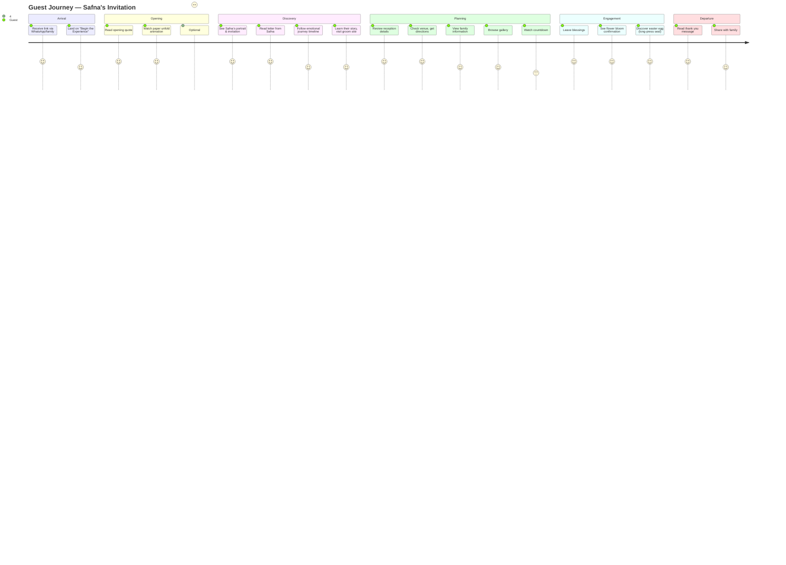

# User Journey

## Journey Phases

### Phase 1: Emotional Entry (0–30s)
Opening quote → paper unfold → hero reveal

### Phase 2: Connection (30s–2min)
Letter → Journey → Their Story

### Phase 3: Logistics (2–4min)
Details → Venue → Family

### Phase 4: Delight (4–6min)
Gallery → Countdown → Blessings → Easter eggs

### Phase 5: Memory (Post-visit)
Return for countdown, leave blessings, revisit after wedding for gallery/film (future)
