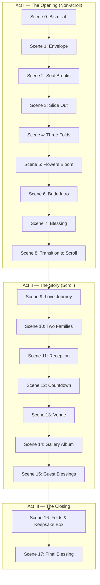

# 01 — UX Strategy

## Executive Summary

Safna's invitation is an **interactive short film** packaged as luxury stationery. The UX goal is not information retrieval — it is **emotional immersion followed by practical clarity**. Guests who complete the opening ritual (Scenes 0–8) should feel they have been personally invited, not merely informed.

---

## Experience Goals

| Emotion | Design Expression |
|---------|-------------------|
| **Curiosity** | Black opening, envelope mystery, wax seal |
| **Emotion** | Letter unfold, bride portrait, personal blessing |
| **Elegance** | Ivory paper, Cormorant typography, generous whitespace |
| **Luxury** | Slow motion, realistic shadows, tactile micro-interactions |
| **Calmness** | Muted palette, no autoplay aggression, breathing pace |
| **Blessings** | Prayer scene, guest wishes with ink animation |
| **Family** | Two-family merge animation, parent names with reverence |
| **Kerala tradition** | Warm wood tones, natural light, subtle green accents |
| **Islamic values** | Bismillah opening, dua, geometric patterns (never decorative excess) |
| **Timeless memory** | Keepsake box closing — invitation becomes archival object |

---

## Target Audience

### Primary
- Extended family (Palakkad ↔ Thrissur corridor)
- Age 25–65, WhatsApp-first discovery
- Expectation: respectful, beautiful, easy to find date/venue

### Secondary
- Friends and colleagues (mobile, short attention span)
- International guests (need clear IST timing, venue directions)

### Tertiary
- Safna & Jithin (future return visits as digital keepsake)

---

## User Personas

### Persona A — Ammuma (Grandmother)
- **Device:** Shared family phone, 360px width
- **Needs:** Large readable text, clear date/time, no confusion
- **Risk:** Cinematic opening too long or too dark
- **Mitigation:** Skip option after Scene 0; high contrast in Scene 11+; voice-over optional (future)

### Persona B — Cousin (25, Design-aware)
- **Device:** iPhone Pro, desktop for second viewing
- **Needs:** Memorable experience worth sharing on Instagram Stories
- **Risk:** Generic template feel
- **Mitigation:** Unique envelope ritual, editorial gallery, easter eggs

### Persona C — Office Colleague
- **Device:** Desktop at work
- **Needs:** Quick RSVP path, calendar add, directions
- **Risk:** Abandons before Scene 6
- **Mitigation:** Persistent "Skip to Details" after Scene 1; anchor nav appears post-Scene 8

---

## Core UX Principles

### 1. Story Before Structure
Information (date, venue, family) lives inside narrative scenes — never as the opening impression.

### 2. One Action Per Moment
Each scene has a single focal interaction: click seal, scroll, submit blessing. No competing CTAs.

### 3. Respect the Pause
Animations pause between folds. Silence is a design element.

### 4. Progressive Disclosure
Logistics intensify from Scene 11 onward. Emotional peak is Scenes 6–10.

### 5. Graceful Degradation
`prefers-reduced-motion`: skip envelope 3D, show static unfolded invitation, preserve all content.

### 6. No Dead Ends
Every scene advances. Back navigation is optional; forward is inevitable through scroll or tap.

---

## Experience Architecture

---

## Key User Flows

### Flow 1 — First Visit (Full Experience)
**Duration:** 4–6 minutes  
**Path:** Scenes 0–17 uninterrupted  
**Success:** Reaches Scene 17, optionally leaves blessing

### Flow 2 — Return Visit (Countdown Check)
**Duration:** 30 seconds  
**Path:** LocalStorage flag → skip to Scene 8 or Scene 12  
**Success:** Sees countdown, gets directions

### Flow 3 — Mobile Share (WhatsApp Link)
**Duration:** 2 minutes minimum viable  
**Path:** Scene 0 → tap through opening → Scene 11 within 90s  
**Success:** Finds date/venue without frustration

---

## Information Priority Matrix

| Priority | Content | Scene |
|----------|---------|-------|
| P0 | Wedding date, time, venue | 11, 13 |
| P0 | Bride & groom names, families | 6, 10 |
| P1 | Islamic date, dress code | 11 |
| P1 | Directions, parking | 13 |
| P2 | Love journey narrative | 9 |
| P2 | Gallery | 14 |
| P3 | Guest blessings | 15 |
| P3 | Cross-link to groom site | 9 or 10 |

---

## Success Metrics

| Metric | Target | Tool |
|--------|--------|------|
| Opening completion rate (Scene 0→8) | > 70% | Vercel Analytics events |
| Avg. session duration | 3–5 min | Analytics |
| Blessing submissions | Track volume | Supabase |
| Directions click-through | > 40% of mobile | Event tracking |
| Bounce before Scene 6 | < 25% | Funnel |
| Lighthouse Performance | ≥ 90 | CI |
| Reduced-motion opt-out usage | Track | `matchMedia` event |

---

## Accessibility Strategy (UX Level)

- **Scene 0–8:** Keyboard-operable (Enter/Space to advance); screen reader announcements per scene change
- **Skip intro:** Visible after Scene 1, always reachable
- **Focus management:** Trap during modal scenes; release on Scene 8
- **Captions:** All Arabic/Urdu text paired with transliteration
- **Touch targets:** Minimum 44×44px on seal, buttons

---

## Competitive Positioning

Unlike generic wedding templates (Joy, WithJoy, Canva exports), this experience:

- Has **directed pacing** like Awwwards narrative sites
- Uses **physical metaphor** (paper, envelope, box) like luxury brand campaigns
- Maintains **cultural authenticity** without cliché (no pink glitter, no stock florals)
- Complements rather than duplicates the groom's existing polished site

---

## Risks & Mitigations

| Risk | Impact | Mitigation |
|------|--------|------------|
| Opening too long on 3G | High bounce | Preload critical assets; progressive enhancement |
| Motion sickness | Accessibility | Reduced motion path |
| Audio annoyance in public | Negative UX | Never autoplay; explicit opt-in at Scene 5 |
| Envelope doesn't work on old Android | Broken first impression | 2D CSS fallback identical in content |

---

## Approval Checklist

- [ ] Act structure (I / II / III) approved
- [ ] Persona mitigations accepted
- [ ] Skip-intro strategy approved
- [ ] Success metrics agreed

---

*Next document: [02 — Storyboard](./02-storyboard.md)*
