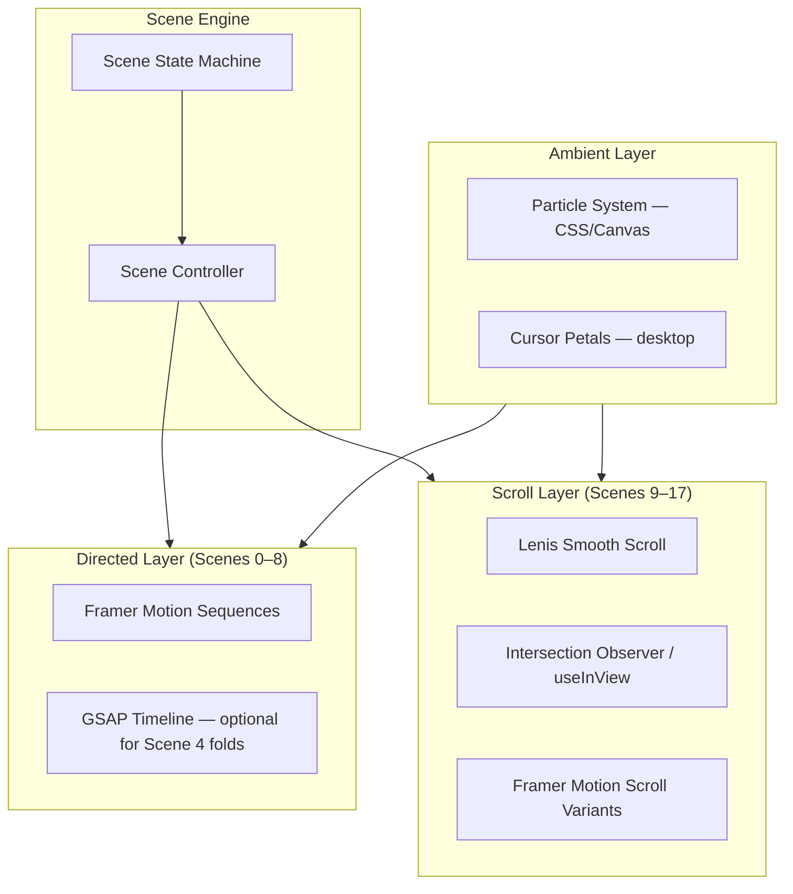

# 06 — Motion System

Motion architecture for a 60fps cinematic experience. **Slow. Natural. Elegant. Breathing.**

---

## Motion Philosophy

| Rule | Rationale |
|------|-----------|
| No bounce | Luxury never springs |
| No flash | Transitions serve story, not spectacle |
| Pause between acts | 0.3–0.8s holds between fold stages |
| Ease curves feel organic | Custom cubic-bezier, never `linear` except particles |
| One focal motion per scene | Avoid competing animations |
| Respect `prefers-reduced-motion` | Full alternative paths, not disabled content |

---

## Easing Library

```typescript
export const EASING = {
  /** Primary — organic deceleration */
  luxury: [0.22, 1, 0.36, 1] as const,
  
  /** Entrances — soft arrival */
  enter: [0.25, 0.1, 0.25, 1] as const,
  
  /** Exits — gentle departure */
  exit: [0.4, 0, 0.2, 1] as const,
  
  /** Paper fold — slight overshoot feel without bounce */
  fold: [0.33, 0.66, 0.66, 1] as const,
  
  /** Ambient breathing */
  breathe: [0.45, 0, 0.55, 1] as const,
} as const;

export const DURATION = {
  instant: 0.15,
  fast: 0.4,
  normal: 0.8,
  slow: 1.2,
  cinematic: 2.0,
  unfold: 1.5,
  hold: 0.8,
} as const;
```

---

## Animation Architecture



### Technology Assignment

| Use Case | Tool | Reason |
|----------|------|--------|
| Scene state machine | Zustand + React | Lightweight, debuggable |
| Directed sequences 0–8 | Framer Motion `AnimatePresence` + `useAnimate` | React-native, declarative |
| Tri-fold unfold (Scene 4) | Framer 3D `rotateY` OR GSAP if jank | GSAP only if Framer can't hit 60fps |
| Scroll scenes 9–17 | Framer `useInView` + variants | Consistent API |
| Smooth scroll | Lenis 1.x | Industry standard, 60fps |
| Particles (Scene 5) | CSS animations | Zero JS overhead |
| Page turn (Scene 14) | Framer `rotateY` + perspective | No R3F needed |
| Keepsake box (Scene 16) | Framer sequence | 2D sufficient |
| 3D envelope | **Not in v1** | 2D layered SVG/CSS achieves illusion |

**React Three Fiber:** Deferred. Only justified if art direction demands true 3D wax seal physics in v2.

---

## Reusable Motion Components

### `<FadeReveal />`
```typescript
interface FadeRevealProps {
  delay?: number;
  duration?: number;
  blur?: boolean;        // 12px → 0
  direction?: 'up' | 'down' | 'none';
  once?: boolean;
}
```
Scroll-triggered. Default: opacity 0→1, y 24→0, 0.8s, easing.enter.

### `<LetterReveal />`
Character-by-character opacity + y. 30–40ms stagger. `aria-label` preserves full text.

### `<PaperFold />`
```typescript
interface PaperFoldProps {
  stages: 3;
  stageDuration: 1.5;
  pauseBetween: 0.8;
  onComplete: () => void;
  reducedMotionFallback: 'fadeStack';
}
```

### `<SceneTransition />`
Crossfade between directed scenes. Overlap 0.4s. Manages focus trap.

### `<ParallaxLayer />`
```typescript
speed: 0.2 | 0.3 | 0.5  // scroll multiplier
```
Used in Scene 13 venue photo only.

### `<BloomFlower />`
8-petal radial scale on blessing submit. 2s total. CSS transforms only.

### `<PageTurn />`
```typescript
direction: 'next' | 'prev';
onComplete: () => void;
```
rotateY(-15deg) curl, 0.8s, perspective 1200px.

---

## Scene Motion Choreography

### Directed Act (0–8)

| Scene | Primary Motion | Duration | FPS Target |
|-------|---------------|----------|------------|
| 0 | Opacity fade | 6s | 60 |
| 1 | Scale breathe loop | 6s loop | 60 |
| 2 | Seal fragment translate | 1.2s | 60 |
| 3 | Card translateX + camera scale | 2s | 60 |
| 4 | 3× rotateY fold | 4.5s | 60 (GSAP fallback if <55) |
| 5 | Flower scale stagger + particles | 3s | 60 |
| 6 | Mask reveal + letter stagger | 2s | 60 |
| 7 | Blur reveal | 2s | 60 |
| 8 | Scale morph + mode switch | 2s | 60 |

### Scroll Act (9–17)

| Scene | Trigger | Motion |
|-------|---------|--------|
| 9 | 30% in view | Timeline items stagger 0.15s |
| 10 | 40% in view | Cards slide L/R, line draws |
| 11 | per card | Fade up stagger |
| 12 | in view | Rings animate stroke-dashoffset once |
| 13 | in view | Path draw + parallax |
| 14 | interaction | Page turn on click |
| 15 | submit | Bloom + card insert |
| 16 | 80% scroll | Auto-trigger fold sequence |
| 17 | in view | Line stagger fade |

---

## Micro-Interactions Catalog

| Element | Trigger | Motion | Duration |
|---------|---------|--------|----------|
| Wax seal | hover | brightness + scale 1.05 | 0.3s |
| Wax seal | tap | crack sequence | 1.2s |
| Info card | hover | translateY(-2px), shadow lift | 0.4s |
| Button | hover | background darken 5% | 0.3s |
| Button | active | scale(0.98) | 0.1s |
| Gallery page | click right | rotateY page turn | 0.8s |
| Cursor | mousemove (desktop) | petal spawn | 60 frames life |
| Mute toggle | click | icon crossfade | 0.2s |
| Input | focus | border gold glow | 0.3s |
| Blessing input | type | ink underline draw | 0.2s per keystroke batch |

---

## Performance Budget

| Metric | Budget |
|--------|--------|
| JS bundle (First Load) | < 180kb gzip |
| LCP | < 2.5s |
| Scene 0→1 transition | < 100ms jank |
| Scroll INP | < 200ms |
| Particle count (max) | 20 DOM or 1 canvas layer |
| Concurrent Framer animations | ≤ 8 per viewport |
| Image weight per scene | < 200kb WebP |

### Optimization Rules
1. Lazy load Scenes 9–17 components via `dynamic()`
2. Preload Scene 0–1 assets in `<head>`
3. Use `will-change: transform` only during active animation, remove after
4. Prefer CSS animations for infinite loops (petals, breathe)
5. `useReducedMotion()` hook gates all non-essential motion

---

## Reduced Motion Fallbacks

| Scene | Full Experience | Reduced Motion |
|-------|----------------|----------------|
| 0 | Fade sequence | Static text 2s → advance |
| 1–4 | Envelope ritual | Skip to unfolded card static |
| 5 | Flower bloom | Simple fade in |
| 6 | Letter reveal | Instant full text |
| 8 | Morph transition | Hard cut to scroll |
| 9–15 | Scroll animations | Instant visible |
| 16 | Box sequence | Static box image |
| 17 | Stagger fade | Instant visible |

User can also tap **Skip intro** at Scene 1.

---

## Audio Sync Points

| Scene | Event | Sound |
|-------|-------|-------|
| 0 | Mount | ambient-room.mp3 loop (-40dB) |
| 2 | Seal break | wax-crack.mp3 |
| 3 | Card slide | paper-slide.mp3 |
| 4 | Each fold | paper-crease.mp3 |
| 5 | Music opt-in | piano-ambient.mp3 fade in |
| 16 | Box close | box-close.mp3 |

All audio via Howler.js or native Audio API with preload on Scene 1.

---

## Debug & QA Tools

- `?debug=scenes` — scene number overlay
- `?scene=6` — jump to scene (dev only)
- Chrome Performance tab: verify 60fps during Scene 4
- `prefers-reduced-motion` emulation in DevTools

---

*Next document: [07 — Folder Structure](./07-folder-structure.md)*
