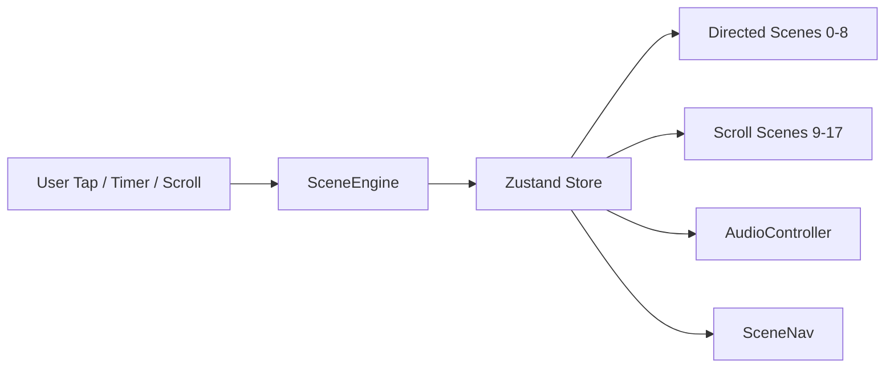

# 08 — Component Tree

Full React component hierarchy with props interfaces and data flow.

---

## Top-Level Tree

```
App (layout.tsx)
└── Providers
    ├── ThemeProvider (next-themes — night mode)
    ├── SceneProvider (Zustand context optional)
    └── Page
        └── SceneEngine
            ├── AudioController
            ├── SkipIntro (conditional: scene >= 1 && <= 7)
            ├── SceneNav (conditional: scene >= 8)
            │
            ├── [Directed Layer] (fixed, scenes 0–8)
            │   ├── Scene00Bismillah
            │   ├── Scene01Envelope
            │   │   ├── WoodTable
            │   │   ├── Envelope
            │   │   └── WaxSeal
            │   ├── Scene02SealBreak
            │   │   ├── Envelope (open state)
            │   │   └── SealFragments
            │   ├── Scene03SlideOut
            │   │   ├── Envelope
            │   │   └── InvitationCard (partial)
            │   ├── Scene04Unfold
            │   │   └── PaperFold
            │   │       └── InvitationCard (full)
            │   ├── Scene05Flowers
            │   │   ├── InvitationCard
            │   │   ├── FlowerParticle × 6
            │   │   └── MusicPrompt
            │   ├── Scene06BrideIntro
            │   │   ├── Portrait
            │   │   ├── LetterReveal (name)
            │   │   └── EventSummary
            │   ├── Scene07Blessing
            │   │   └── FadeReveal (quote)
            │   └── Scene08Transition
            │       └── SceneTransition
            │
            └── [Scroll Layer] (document flow, scenes 9–17)
                ├── SmoothScroll (Lenis wrapper)
                ├── Scene09LoveJourney
                │   └── LoveTimeline
                │       └── TimelineItem × 7
                ├── Scene10Families
                │   ├── FamilyCard (bride)
                │   ├── FamilyCard (groom)
                │   └── MergeAnimation
                ├── Scene11Reception
                │   └── InfoCard × 4
                ├── Scene12Countdown
                │   └── CountdownRing × 4
                ├── Scene13Venue
                │   ├── VenuePhoto (ParallaxLayer)
                │   ├── JourneyPath
                │   └── DirectionButtons
                ├── Scene14Gallery
                │   └── PageTurn
                │       └── GalleryPage
                ├── Scene15Blessings
                │   ├── BlessingForm
                │   │   ├── Input (name)
                │   │   └── Textarea (message)
                │   ├── BloomFlower (on success)
                │   └── BlessingCard × n
                ├── Scene16Keepsake
                │   ├── PaperFold (reverse)
                │   ├── KeepsakeBox
                │   └── WoodTable
                └── Scene17Final
                    ├── NamesDisplay
                    ├── WeddingSeal (easter egg)
                    └── FadeOut
```

---

## SceneEngine — Orchestrator

```typescript
interface SceneEngineProps {
  initialScene?: SceneId;
  skipIntro?: boolean;
}

// Reads/writes sceneStore
// Renders directed OR scroll layer based on scene.mode
// Handles auto-advance timers
// Manages focus trap in directed mode
```

### State Flow



---

## Key Component Interfaces

### `Envelope`
```typescript
interface EnvelopeProps {
  state: 'closed' | 'flap-open' | 'empty';
  onSealClick?: () => void;
  className?: string;
}
```

### `PaperFold`
```typescript
interface PaperFoldProps {
  direction: 'unfold' | 'fold';
  stages?: 3;
  onStageComplete?: (stage: number) => void;
  onComplete?: () => void;
  children: React.ReactNode; // InvitationCard content
}
```

### `InfoCard`
```typescript
interface InfoCardProps {
  icon: LucideIcon;
  label: string;
  primary: string;
  secondary?: string;
}
```

### `FamilyCard`
```typescript
interface FamilyCardProps {
  side: 'bride' | 'groom';
  parents: string;
  house: string;
  address: string[];
}
```

### `BlessingForm`
```typescript
// React Hook Form + Zod
interface BlessingFormValues {
  name: string;    // max 80
  message: string; // max 500
}
```

### `CountdownRing`
```typescript
interface CountdownRingProps {
  value: number;
  label: 'Days' | 'Hours' | 'Minutes' | 'Seconds';
  max?: number; // for stroke animation
}
```

### `PageTurn`
```typescript
interface PageTurnProps {
  images: GalleryImage[];
  currentIndex: number;
  onIndexChange: (index: number) => void;
}
```

---

## Zustand Store Shape

```typescript
interface SceneStore {
  // Scene navigation
  currentScene: SceneId;
  mode: 'directed' | 'scroll';
  advanceScene: () => void;
  jumpToScene: (id: SceneId) => void;
  skipIntro: () => void;

  // Visit persistence
  hasVisitedBefore: boolean;
  introCompleted: boolean;
  setIntroCompleted: () => void;

  // Audio
  audioEnabled: boolean;
  audioMuted: boolean;
  enableAudio: () => void;
  toggleMute: () => void;

  // UI
  showSceneNav: boolean;
}
```

Persisted to `localStorage`: `hasVisitedBefore`, `introCompleted`.

---

## Data Flow — Blessings

```
BlessingForm (client)
  → react-hook-form validate (Zod)
  → POST /api/blessings
  → Supabase insert
  → Response → BlessingCard render
  → BloomFlower animation
```

---

## Provider Stack

```typescript
// providers.tsx
export function Providers({ children }: { children: React.ReactNode }) {
  return (
    <ThemeProvider attribute="class" enableSystem={false}>
      {children}
    </ThemeProvider>
  );
}
```

---

## Accessibility Component Map

| Component | ARIA Role | Notes |
|-----------|-----------|-------|
| SceneEngine (directed) | `role="application"` | aria-live for scene changes |
| WaxSeal | `button` | aria-label="Open invitation" |
| SkipIntro | `link` | Skip to main content |
| SceneNav | `navigation` | aria-label="Scene progress" |
| PageTurn | `region` | aria-label="Photo gallery" |
| BlessingForm | standard form | associated labels |
| CountdownRing | `timer` | aria-live polite on change |

---

*Next document: [09 — Development Roadmap](./09-development-roadmap.md)*
